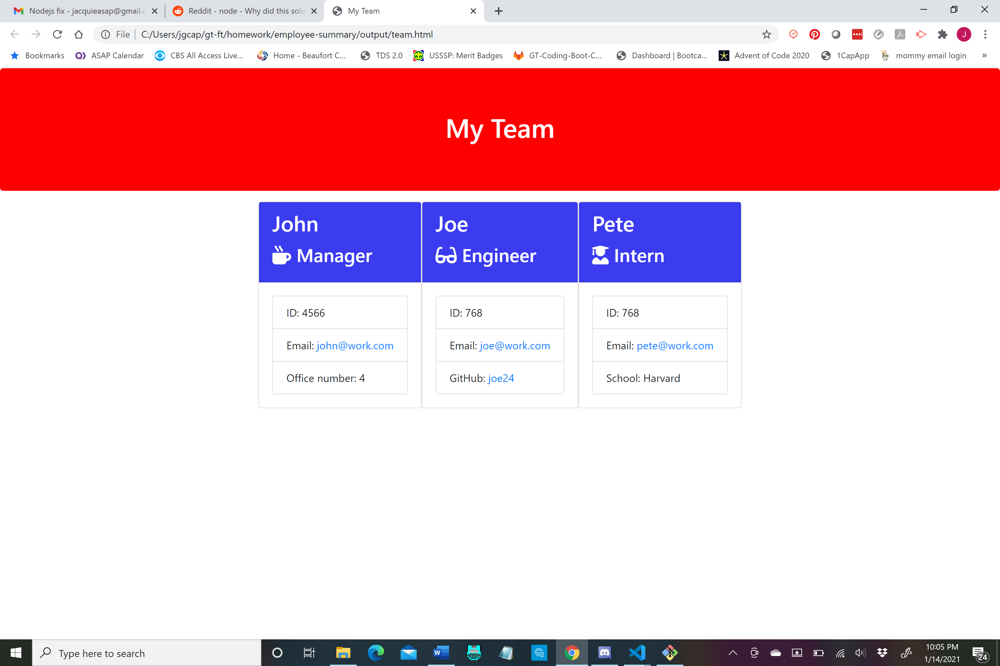

# Team Profile Generator

  
  
  ## Table of Contents
  - [Description](#description)
  - [Installation](#installation)
  - [Usage](#usage)
  - [Contributing](#contributing)
  - [Tests](#tests)
  - [Questions](#questions)
  - [License](#license)

  ### Description
  The goal of this project was to create a Command Line Interface that enables the user to create a team profile by entering various team members and their information, such as name, email address, and job role.  The team info is then generated on an html page.  This app combined HTML, Javascript, and Nodejs functions to make it work seamlessly.
  
  ### Installation
  Please go to my GitHub repo and fork the repository then run in your own terminal.
  
  ### Usage
  This application is open for all users.  Simply fork the repository then run in your own terminal.  Upon issuing the command node app.js, you will see a series of prompts.  .  Once all questions have been answered and the user responds they do not wish to add any more team members, then an html page is generated.  Upon opening the html page, this is what the user will see, a complete list of all team members entered 
  
  ### Contributing
  Please fork the repo and then generate a pull request if you'd like to make any changes.
  
  ### Tests
  No testing procedures.
  
  ### Questions
  For questions, please check out my [GitHub](https://github.com/jacquie24) page first.  If you have any further questions, you can email me directly at jgcaption@yahoo.com.
  
  ### License
  This page uses the [MIT](https://choosealicense.com/licenses/mit/) license.
